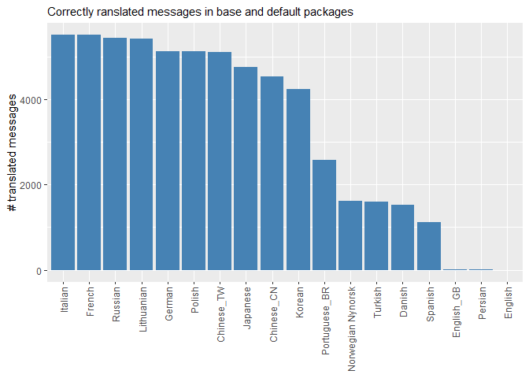

# Evaluating the status of translations in R

The script `translations_status.R` produces datasets regarding message
translations from a local clone of <https://github.com/r-devel/r-svn>, a
mirror of the SVN repository containing the source code for R. The
script is designed to be run interactively and requires the file path of
the `r-svn` repo and an output directory to be specified. The datasets
are saved in the output directory with the short SHA and date of the git
commit on which they were based as a suffix.

## Languages CSV

A CSV with the variables:

-   `package`: the name of a package containing messages to be
    translated
-   `po_file`: the name of `.po` files in the package sources
-   `component`: the “component” of the package the PO file relates to,
    either “C”, “R”, “RGui” (the latter is only in the base package)
-   `code`: the ISO 639 code for the language the PO file relates to
-   `variant`: the variant of the language, if applicable (e.g. BR for
    pt-BR)
-   `language`: the name of the language in English
-   `country`: the country corresponding to the variant

## Metadata CSV

A CSV with the variables:

-   `package`: the name of a package containing messages to be
    translated
-   `po_file`: the name of `.po` files in the package sources
-   `r_version`: the name of the R version to PO file relates do (does
    not always match `pot_creation_date`)
-   `bug_reports`: where to report bugs related to this PO file
-   `pot_creation_date`: the date the PO template file was created (when
    messages last updated), YYYY-MM-DD format
-   `po_revision_date`: the date the PO file was revised, YYYY-MM-DD
    format
-   `last_translator`: the name and email of the last translator
-   `team`: the name and/or email of the translation team

## Message status CSV

A CSV with the variables:

-   `package`: the name of a package containing messages to be
    translated
-   `po_file`: the name of `.po` files in the package sources
-   `message`: a message in the PO file
-   `translated`: a logical value indicating if the message has been
    translated
-   `fuzzy`: a logical value indicating if the translation is flagged as
    “fuzzy”, i.e. a fuzzy match of an old translation to a message that
    has had a minor update

## Example plot

``` r
library(dplyr)
library(forcats)
library(ggplot2)
library(readr)
```

``` r
message_status <- read_csv("message_status_4168b6f_2022-04-25.csv")
languages <- read_csv("languages_4168b6f_2022-04-25.csv")
```

First a little tidying to create short names for the dialects

``` r
plot_dat <- left_join(message_status, languages) |>
    mutate(dialect = ifelse(is.na(variant),
                            gsub("([^;]+).*", "\\1", language),
                            paste(language, variant, sep = "_")))
```

    ## Joining, by = c("package", "po_file")

Then we can plot the counts of correctly translated messages from the C
or R code

``` r
ggplot(filter(plot_dat, translated, !fuzzy, component != "RGui"),
       aes(x = fct_infreq(dialect))) +
    geom_bar(stat = "count", fill = "steelblue") +
    theme(axis.text.x = element_text(angle = 90, vjust = 0.5, hjust = 1),
          legend.position = "none") +
    labs(x = NULL, y = "# translated messages",
         subtitle = "Correctly ranslated messages in base and default packages")
```

<!-- --> There is one
message translation in standard English - this is to add information
about the locale to the startup message in R.

## Alternative script and data

The `get_r_translation_status.R` script is an alternative approach to
obtaining data on translation status in R. Unlike the above, it
considers all commits since translations were introduced. For each
commit, `get_r_translation_status_for_revision.R` is called to compute
the number of of translated messages.

Only non-fuzzy translations are counted and translations for the RGui
are ignored. The messages are extracted with
`potools:::get_po_messages`.

The file `4168b6fff27eafad68a4b134dba5c7d09e090fcb.csv` contains the
results for the r-svn commit with hash
4168b6fff27eafad68a4b134dba5c7d09e090fcb. This CSV has columns

-   `git_commit`: the commit hash
-   `package`: the name of a package in the R sources
-   `language`: the ISO 639 code of the language, including variant
-   `type`: either “C” or “R”
-   `n_translated`: number of correctly translated messages
-   `n_untranslated`: number of oncorrectly translated messages

Currently, the code over-counts the number translated by 1, since it
counts the empty message at the start of the PO files.

The code to convert the ISO 639 codes to names also mistakenly converts
`nn` to Nederlands (Dutch) vs Nynorsk (Norwegian).
