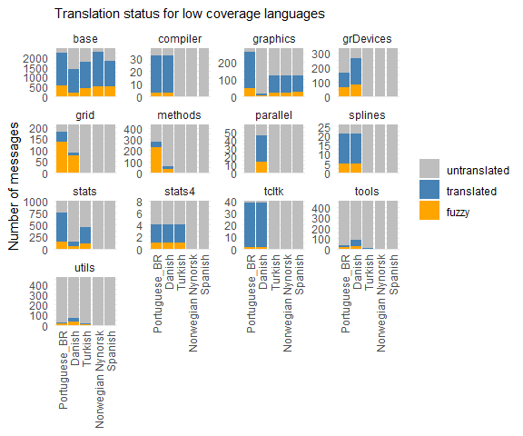

Plots for blog post
================

``` r
library(dplyr)
library(forcats)
library(ggplot2)
library(lubridate)
library(readr)
```

``` r
metadata <- read_csv("metadata.csv")
message_status <- read_csv("message_status.csv")
```

General overview

``` r
tally_status <- message_status |>
    mutate(group = ifelse(fuzzy, "fuzzy", 
                          ifelse(translated, "translated",
                                 "untranslated")),
           group = factor(group, levels = c("untranslated", "translated", "fuzzy"))) |>
    group_by(language, group) |>
    tally() |>
    arrange(group, n)
ggplot(tally_status, aes(fill = group, x = fct_inorder(language), y = n)) +
    geom_bar(stat = "identity", position = "stack") +
    labs(x = NULL, y = "Number of messages",
         subtitle = "Translation status in base and default packages") + 
    scale_fill_manual(values = c("grey", "steelblue", "orange")) + 
    scale_y_continuous(expand = c(0, 0)) +
    theme_minimal() +
    theme(axis.text.x = element_text(angle = 90, vjust = 0.5, hjust = 1),
          legend.title=element_blank())
```

<!-- -->

``` r
xtabs(!is.na(po_file) ~ language + component, metadata)
```

    ##                    component
    ## language             C  R RGui
    ##   Chinese_CN        10 13    1
    ##   Chinese_TW        11 13    1
    ##   Danish            10 13    1
    ##   English            1  0    0
    ##   English_GB         2  1    0
    ##   French            11 13    1
    ##   German            11 13    1
    ##   Italian           11 13    1
    ##   Japanese           9 12    1
    ##   Korean            11 13    1
    ##   Lithuanian        11 13    1
    ##   Norwegian Nynorsk  2  1    1
    ##   Persian            1  2    1
    ##   Polish            11 13    1
    ##   Portuguese_BR      9 12    1
    ##   Russian           11 13    1
    ##   Spanish            2  0    1
    ##   Turkish            2  5    1

Looking into date of last translation (what happened to Italian,
Korean,…?)

``` r
metadata <-  metadata |>
    mutate(diff_date = interval(pot_creation_date, po_revision_date) %/% years(1))
ggplot(na.omit(metadata), aes(x = fct_reorder(language, diff_date, .fun = mean, 
                                              .desc = TRUE), y = diff_date)) +
    geom_jitter(width = 0.3) +
    labs(x = NULL, y = "Lag (years)",
         subtitle = "Lag in translating messages") + 
    theme_minimal() + 
    theme(axis.text.x = element_text(angle = 90, vjust = 0.5, hjust = 1))
```

<!-- --> Coverage by package
(Korean has some of all)

Norwegian and Spanish - only base and graphics Turkish - plus stats and
stats4 Portuguese and Danish - some of all packages, but in some cases
only a small proportion: utils and tools

``` r
select_lang <- c("Norwegian Nynorsk", "Portuguese_BR", 
                           "Turkish", "Danish", "Spanish")
tally_status <- message_status |>
    filter(language %in% select_lang) |>
    mutate(language = factor(language, levels = select_lang),
           group = ifelse(fuzzy, "fuzzy", 
                          ifelse(translated, "translated",
                                 "untranslated")),
           group = factor(group, levels = c("untranslated", "translated", "fuzzy"))) |>
    group_by(language, package, group) |>
    tally() |>
    arrange(group, n)
ggplot(tally_status, aes(fill = group, x = fct_inorder(language), y = n)) +
    geom_bar(stat = "identity", position = "stack") +
    facet_wrap(~ package, scale = "free_y") + 
    labs(x = NULL, y = "Number of messages",
         subtitle = "Translation status for low coverage languages") + 
    scale_fill_manual(values = c("grey", "steelblue", "orange")) + 
    scale_y_continuous(expand = c(0, 0)) +
    theme_minimal() +
    theme(axis.text.x = element_text(angle = 90, vjust = 0.5, hjust = 1),
          legend.title=element_blank())
```

<!-- -->
