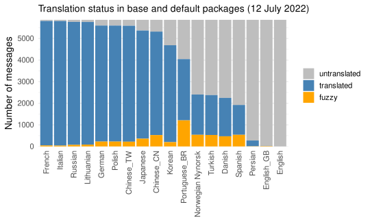
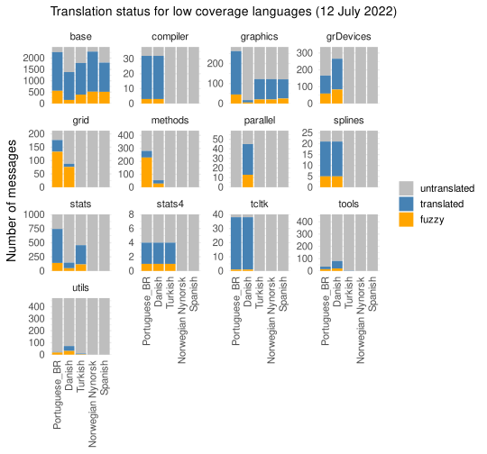

Plots for blog post
================

``` r
library(dplyr)
library(forcats)
library(ggplot2)
library(lubridate)
library(readr)
library(tidyr)
library(svglite)
```

``` r
metadata <- read_csv("metadata.csv")
message_status <- read_csv("message_status.csv")
format_date <- format(metadata$date[1], "%d %B %Y")
```

``` r
tally_status <- message_status |>
    mutate(group = ifelse(fuzzy, "fuzzy", 
                          ifelse(translated, "translated",
                                 "untranslated")),
           group = factor(group, levels = c("untranslated", "translated", "fuzzy"))) |>
    group_by(language, group) |>
    tally() |>
    arrange(group, n)
ggplot(tally_status, aes(fill = group, x = fct_inorder(language), y = n)) +
    geom_bar(stat = "identity", position = "stack") +
    labs(x = NULL, y = "Number of messages",
         subtitle = paste0("Translation status in base and default packages (", 
                           format_date, ")")) + 
    scale_fill_manual(values = c("grey", "steelblue", "orange")) + 
    scale_y_continuous(expand = c(0, 0)) +
    theme_minimal(base_size = 14) +
    theme(axis.text.x = element_text(angle = 90, vjust = 0.5, hjust = 1),
          legend.title=element_blank())
```

<!-- -->

``` r
pivot_wider(tally_status, names_from = group, values_from = n)
```

    ## # A tibble: 18 × 4
    ## # Groups:   language [18]
    ##    language          untranslated translated fuzzy
    ##    <chr>                    <int>      <int> <int>
    ##  1 French                      54       5760    48
    ##  2 Italian                     57       5765    40
    ##  3 Russian                     95       5693    74
    ##  4 Lithuanian                  99       5677    86
    ##  5 German                     265       5371   226
    ##  6 Polish                     266       5370   226
    ##  7 Chinese_TW                 274       5368   220
    ##  8 Japanese                   496       5005   361
    ##  9 Chinese_CN                 545       4789   528
    ## 10 Korean                    1176       4487   199
    ## 11 Portuguese_BR             1818       2835  1209
    ## 12 Norwegian Nynorsk         3457       1866   539
    ## 13 Turkish                   3484       1846   532
    ## 14 Danish                    3613       1778   471
    ## 15 Spanish                   3941       1381   540
    ## 16 Persian                   5587        266     9
    ## 17 English_GB                5833         11    18
    ## 18 English                   5861          1    NA

``` r
metadata <-  metadata |>
    mutate(diff_date = interval(pot_creation_date, po_revision_date) %/% years(1))
ggplot(na.omit(select(metadata, language, diff_date)), 
               aes(x = fct_reorder(language, diff_date, .fun = mean, 
                                   .desc = TRUE), y = diff_date)) +
    geom_jitter(width = 0.2) +
    labs(x = NULL, y = "Lag (years)",
         subtitle = paste0("Lag in translation (", format_date, ")")) + 
    theme_minimal(base_size = 14) + 
    theme(axis.text.x = element_text(angle = 90, vjust = 0.5, hjust = 1))
```

<!-- -->

``` r
select_lang <- c("Norwegian Nynorsk", "Portuguese_BR", 
                           "Turkish", "Danish", "Spanish")
tally_status <- message_status |>
    filter(language %in% select_lang) |>
    mutate(language = factor(language, levels = select_lang),
           group = ifelse(fuzzy, "fuzzy", 
                          ifelse(translated, "translated",
                                 "untranslated")),
           group = factor(group, levels = c("untranslated", "translated", "fuzzy"))) |>
    group_by(language, package, group) |>
    tally() |>
    arrange(group, n)
ggplot(tally_status, aes(fill = group, x = fct_inorder(language), y = n)) +
    geom_bar(stat = "identity", position = "stack") +
    facet_wrap(~ package, scale = "free_y") + 
    labs(x = NULL, y = "Number of messages",
         subtitle = paste0("Translation status for low coverage languages (", 
                           format_date, ")")) + 
    scale_fill_manual(values = c("grey", "steelblue", "orange")) + 
    scale_y_continuous(expand = c(0, 0)) +
    theme_minimal(base_size = 14) +
    theme(axis.text.x = element_text(angle = 90, vjust = 0.5, hjust = 1),
          legend.title=element_blank())
```

<!-- -->

``` r
pivot_wider(tally_status, names_from = group, values_from = n) |>
    arrange(package) |>
    mutate(total = translated  + fuzzy) |>
    select(-untranslated)
```

    ## # A tibble: 65 × 5
    ## # Groups:   language, package [65]
    ##    language          package  translated fuzzy total
    ##    <fct>             <chr>         <int> <int> <int>
    ##  1 Norwegian Nynorsk base           1764   519  2283
    ##  2 Portuguese_BR     base           1702   559  2261
    ##  3 Spanish           base           1285   515  1800
    ##  4 Turkish           base           1391   392  1783
    ##  5 Danish            base           1226   157  1383
    ##  6 Portuguese_BR     compiler         29     3    32
    ##  7 Danish            compiler         29     3    32
    ##  8 Norwegian Nynorsk compiler         NA    NA    NA
    ##  9 Turkish           compiler         NA    NA    NA
    ## 10 Spanish           compiler         NA    NA    NA
    ## # … with 55 more rows
