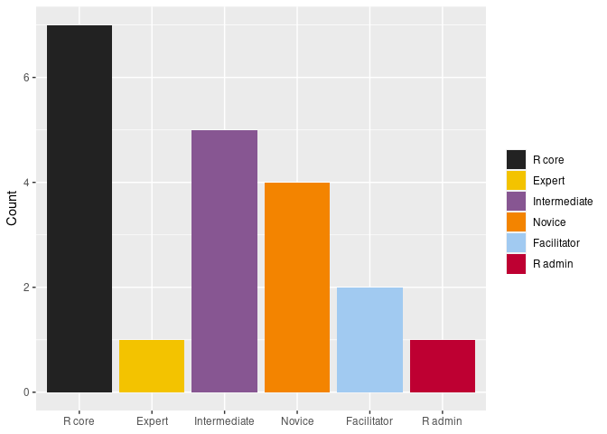
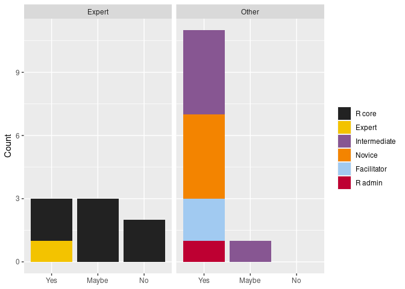
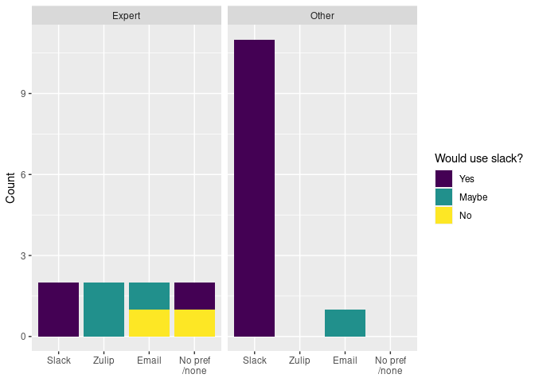
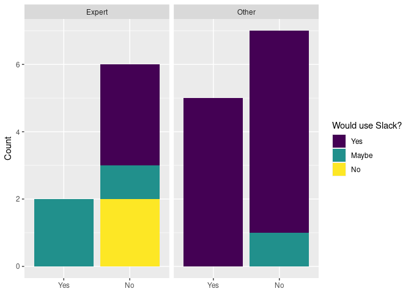
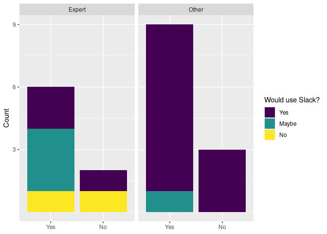
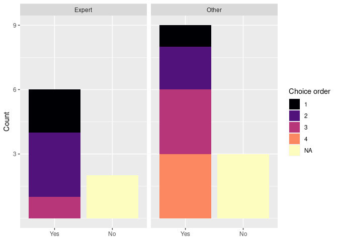
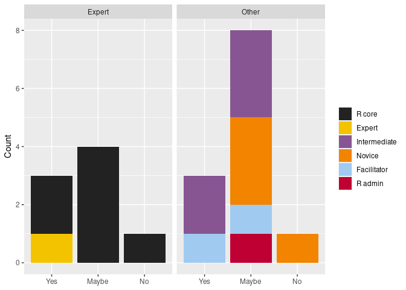
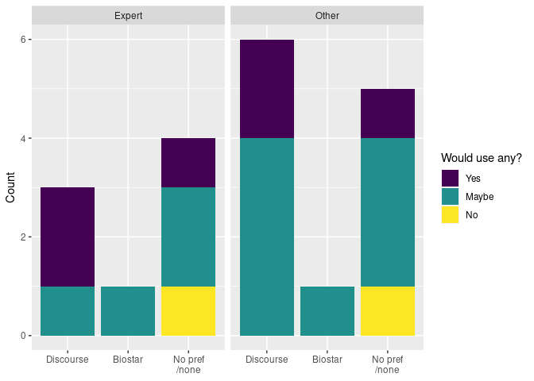

Survey on Chat/Q\&A Platforms
================

## Background

Following up on the idea of a mentorship forum for R core contributors
(discussed in [this
issue](https://github.com/forwards/rcontribution/issues/5) and at our
[September 2020
meeting](https://github.com/forwards/rcontribution/blob/master/team_minutes/2020-09-08.md)),
a short survey was conducted to gather views on potential chat/Q\&A
tools among the R Foundation and members of the On Ramps team.

As one respondent clarified:

  - **R core member** is someone with commit permissions to the R core
    repository
  - **contributor** someone that contributes patches to R that would be
    applied by an R core member

This initiative seeks to encourage contributors to R core (someone that
makes significant contributions might eventually become part of R core,
but that is not the main focus here).

## Respondents

  - 8 R core members/expert contributors to R core
  - 12 intermediate/novice contributors, community organizers or other
    (R admin/package author)

<!-- -->

## Chat Platforms

### Slack

In the initial discussions, there seems to be a preference for Slack, so
this was asked about explicitly.

Would they use Slack as a mentoring platform?

  - Experts: 3 yes, 3 maybe, 2 no
  - Other: 11 yes, 1, maybe

<!-- -->

### Preferred platform

Respondents were asked to (partially) rank their preferred platform out
of Slack, Zulip, Mattermost, IRC and email mailing list. A comparison
table of these platforms was given for background information
([chat\_platforms.csv](chat_platforms.csv)).

What is the platform they would most prefer to use?

  - Experts: split across Slack, Zulip and email
  - Other: the one that would maybe use Slack prefers email

Of the experts that would not use Slack, one would use email, one would
not use any platform (not enough time to engage in chat-style
communication, only hope would be asynchronous messaging).

Some strongly prefer Zulip since it is FOSS.

<!-- -->

### Zulip

Would it be better to use Zulip?

  - Experts: brings maybes on board, but most would not use
  - Other: most would not use

Many do not know Zulip and would prefer not to use a new tool (one
suggested Discord, but likely that is also new to many).

<!-- -->

### Email

Would it be better to use Email?

  - Experts: brings most on board, though most of these would/might use
    Slack
  - Other: better than Zulip, but still lose some intermediate/novice
    contributors

<!-- -->

For most people it is not their first choice and is 3rd or 4th choice
among many non-experts.

<!-- -->

### Proposal

Start Slack group and see if engagement from experts is sufficient to be
worth it.

If people are invited to Slack - even if they do not join - they can
receive email notifications when people contact them use @mentions,
direct messages or @channel. So we could invite interested R core
members to a special channel and use @channel when help is needed beyond
the people active on Slack - they can then respond by email and the
reply will appear in Slack.

## Q\&A Platforms

Would people use a Q\&A platform?

  - Experts: much the same attitude as towards the chat platform
  - Other: much more uncertain, particularly novice/potential
    contributors

<!-- -->

### Preferred platform

Respondents were asked to (partially) rank their preferred platform out
of Biostar, Discourse, Scoold and Talkyard. Again, a comparison table
was provided ([q\_and\_a.csv](chat_platforms.csv)).

Clear preference for Discourse. Reasons:

  - Only know Discourse
  - FOSS
  - Email digest
  - No separate chat function (assuming we already have a Slack/email
    group)

<!-- -->

Notes:

  - All alternatives (Discourse, Biostar, Scoold, Talkyard) are FOSS,
    though for Scoold we would like want features in Scoold Pro
    (e.g. email digest, account suspension, favourite posts, etc) and
    that is closed source.
  - Only Talkyard has separate chat function which can be disabled.

### Proposal

Stick with Slack/email for now, consider setting up Discourse further
down the line.
