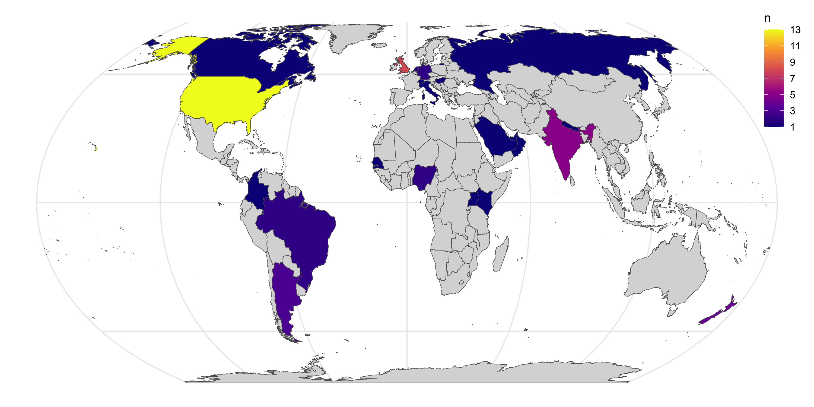
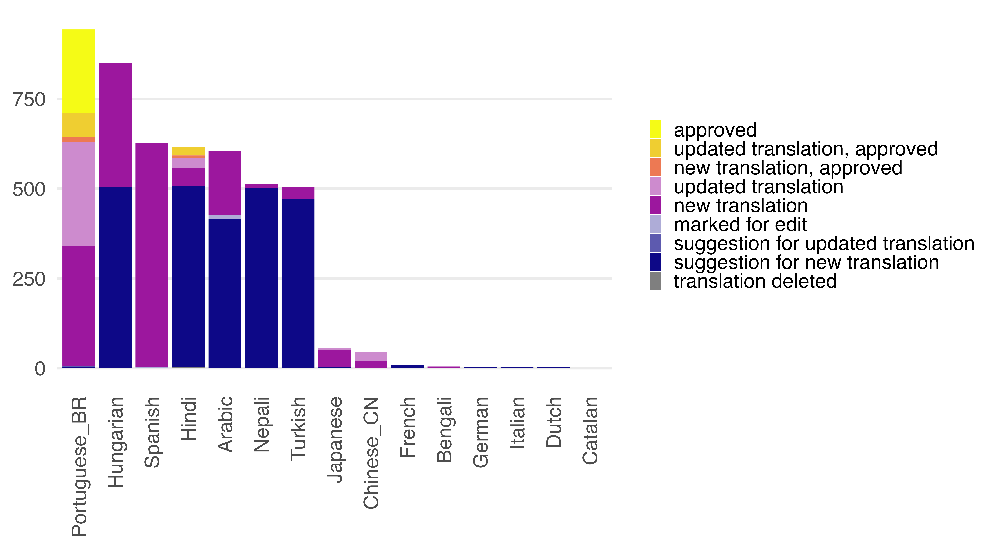
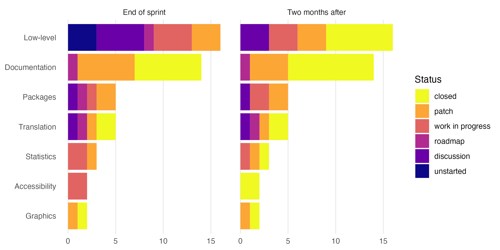
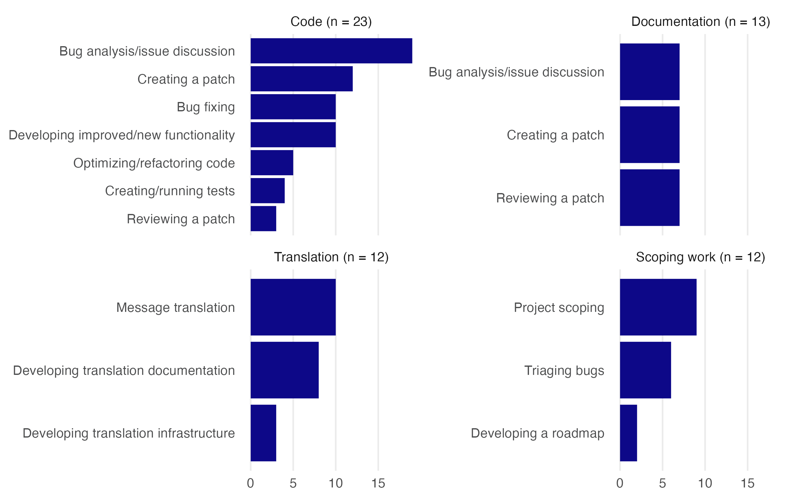
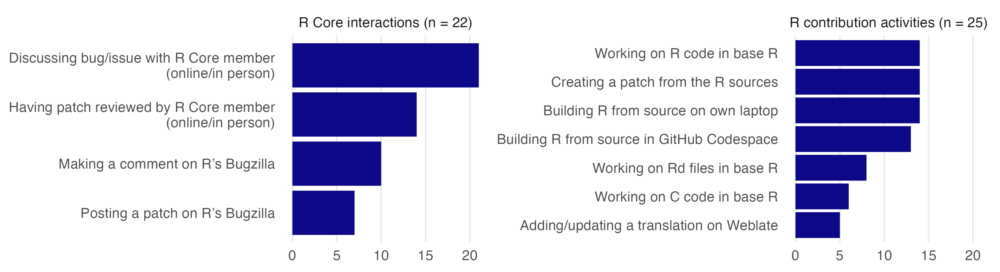

```{r setup, include=FALSE}
knitr::opts_chunk$set(echo = FALSE, warning = FALSE, message = FALSE)
```

## Introduction

R Project Sprint 2023 was a three-day event hosted at the University of Warwick, 
UK. The aim of the event was to bring novice and experienced contributors 
together to work collaboratively with member of the R Core Team - the developers 
that maintain and develop the code and documentation that forms the base 
distribution of R ("base R"). 

## Participants

All members of the R Core Team were invited to the event and 11 members were 
able to participate. Another 13 participants were invited/pre-selected - these 
included local organizers, representatives from sponsors, and experienced 
contributors. The remaining 31 participants were selected on the basis of self 
nomination through an application form (a couple more were selected but ultimately unable to participate). Figure \@ref(fig:photos) shows group 
photos taken on Day 2 and and Day 3 of the sprint. Participation was in-person 
by default, but exceptions were made in a few cases where travel was not 
possible, e.g., due to visa issues. The number online was higher than 
anticipated due to travel disruptions; in the end 7 participated online.

```{r photos, fig.cap = "Photos of sprint participants on Day 2 (top) and Day 3 (bottom), including online participants on screen (not all participants photographed).", fig.alt = c("A photo of 27 in-person participants and two online participants on day 2 of the sprint.", "A photo of 38 in-person participants and two online participants on day 3 of the sprint."), out.width = "100%", fig.show = "hold"}
knitr::include_graphics(c('images/group_thursday.png', 'images/group_friday.png'))
```

Members of demographic groups underrepresented within the contributor community 
were encouraged to apply for a place, by promoting the event to affinity groups (R-Ladies, MiR, RainbowR, AfricaR, ArabR, AsiaR, and LatinR) and by direct 
communication with potential participants. Figure \@ref(fig:map) shows the 
geographical distribution of all 55 participants. There were 16 from Europe with 8 from the UK; 13 from North America with 12 from the USA; 
7 from Asia with 5 from India; 6 from Latin America with 3 from Argentina; 5 from Africa with 2 from Nigeria; 4 from Oceania - all from New Zealand, and 3 from the Middle East.

```{r map, fig.cap = "Choropleth showing the distribution of participants on the world map", fig.alt = c("Continents in order of number of participants. Europe: UK - 8, Germany and Netherlands - 2, Hungary, Italy, Luxembourg, Switzerland - 1. North America: USA - 13, Canada - 1. Asia: India - 5, Nepal and Russia 1. Latin America: Argentina - 3, Brazil - 2, Colombia - 1. Africa: Nigeria - 2, Kenya, Senegal, Uganda - 1. Oceania: New Zealand - 4. Middle East: Oman, Saudi Arabia, United Arab Emirates - 1."), out.width = "100%"}

```

We have further information from the nomination form, which was completed by 40 of the 44 invited/selected contributors. Over half (25/40) self-identified as belonging to one or more underrepresented groups. Figure \@ref(fig:skills) summarises the skills of these contributors as assessed by the selection committee, using data from the nomination forms. A "contributor level" was assigned based on self-ratings of familiarity with relevant concepts and processes, along with answers to free text questions about the applicant's experience and motivation. 
The committee deliberately selected participants to achieve the balance shown in 
the first plot of Figure \@ref(fig:skills): an equal number of advanced and 
novice contributors, with the remainder have intermediate expertise. The second 
plot summarises the potential for contribution to translations: 14 of 
the selected contributors expressed a specific interest in translation; 8 more 
were surmised to have potential based on country of residence, for the 
remainder (22) there was no evidence as we did not ask about this explicitly in the form.

```{r skills, fig.cap = "Skills of external contributors as judged by the selection committee. Left: level of expertise in R contribution. Right: potential as a translator of English to other languages.", fig.alt = c("Bar chart of contributor level. R-core: 11; Advanced: 12; Intermediate: 20, Beginner: 12", "Bar chart of translator potential: R-core: 11; Translator: 14; Possible: 8; No evidence: 22."), out.width = "50%", fig.show = "hold"}
knitr::include_graphics(c('figures/contributor_level.png',
                          'figures/translator_level.png'))
```

## Preparation

There were two sides to preparation for the sprint: gathering suitable tasks to 
work on and helping participants brush up their knowledge and skills.

Anyone with an interest in R development was encouraged to suggest ideas for 
suitable tasks via the discussion forum on the R Project Sprint 2023 GitHub 
repository ([GitHub Discussions](https://github.com/r-devel/r-project-sprint-2023/discussions/categories/ideas)). This provided a space for participating members of R Core to give 
feedback and for participating contributors to express an interest. Sprint 
participants could propose a project by adding a page to the [Projects](https://contributor.r-project.org/r-project-sprint-2023/projects/) 
section of the sprint website. In the run up to the sprint, ideas and projects 
were transferred to [issues on sprint GitHub repository](https://github.com/r-devel/r-project-sprint-2023/issues) 
along with further last-minute ideas from core developers and members of the R 
Contribution Working Group. This enabled participants to assign themselves to 
issues and provided a way to track tasks during the sprint.

To help those with less experience prepare for the sprint, participants were 
pointed to resources created by the R Core Team and the 
[R Contribution Working Group (RCWG)](https://contributor.r-project.org/working-group), 
including the R Blog post on [reviewing bugs](https://blog.r-project.org/2019/10/09/r-can-use-your-help-reviewing-bug-reports/index.html) and
the useR! 2021 tutorials on [analysing bugs/contributing patches](https://contributor.r-project.org/tutorials/contributing-to-r/) and 
[translating messages in R](https://contributor.r-project.org/tutorials/translating-r-to-your-language/). In addition, participants were encouraged to engage with relevant events, 
in particular the [Debugging in R](https://youtu.be/179x00KGd9M) tutorial run 
by Shannon Pileggi for R-Ladies Remote, and the [C Book Club for R Contributors](https://contributor.r-project.org/events/c-book-club-2023/) and 
[R Contributor Office Hours](https://contributor.r-project.org/events/office-hours/) 
run by the RCWG.

It was expected that participants would be able to build R from source on the 
laptop they brought to the sprint. People new to this were pointed to the 
[R-admin manual](https://cran.r-project.org/doc/manuals/r-devel/R-admin.html), 
the [R Dev Guide](https://contributor.r-project.org/rdevguide/) and the 
prototype [GitHub Codespace](https://github.com/r-devel/r-dev-env/) which 
provides a virtual environment in which to build R - this was demonstrated in 
one of the contributor office hours.

## Format

The sprint began with a hybrid evening welcome event where Martyn Plummer gave some opening remarks on contributing to the R Project, then participants split into small groups to chat to a member of R Core. This was followed by an informal drinks reception for in-person participants.

Each sprint day started with a kick-off session and ended with a report-back session, both hybrid to include our online participants. On the first day, R Core members gave short talks in these sessions, giving a taste of their work for the R Project. Otherwise the sessions were use to allocate people to tasks 
and summarise progress.

The remaining day time was spent working in small groups, sometimes arranging 
hybrid meetings to discussion specific issues. 

On the second evening, in-person participants enjoyed a conference dinner, whilst on the final evening the sprint participants joined the Warwick R User 
Group for a hybrid meetup to share progress at the sprint, this was followed by a buffet dinner for in-person participants.

## Translation

A key activity during the sprint was work on translating English strings for 
localization of R. In 2022, Gergely Daróczi set up a Weblate instance at 
<https://translate.rx.studio> that provides a user-friendly interface for 
contributing translations to the R Project. Sprint participants created a new 
set of [guidelines for translators](https://contributor.r-project.org/translations/) and 
a new section in the R Dev Guide on [How to contribute new translations](https://contributor.r-project.org/rdevguide/message-translations.html#how-to-contribute-new-translations). Several new features were enabled on the Weblate instance, 
including translation memory, hyperlinking to the source string location and 
dedicated reviewers to approve translations. New components were added, so that 
the instance not only covers base R (messages, warnings, errors and the 
Windows GUI), but also the Mac GUI and recommended packages.

Figure \@ref(fig:translation) gives a summary of activity on Weblate during 
the sprint: around 2000 messages were changed over 14 languages. The 
vast majority of this activity can be attributed to the sprint 
directly or indirectly - the Hungarian translations were imported from earlier 
work in 2011 and the Turkish translations were made by external contributors 
after the Mac GUI component was added.

```{r translation, fig.cap = "Changes in the R Project components on Weblate during the three days of the sprint", fig.alt = "Stacked bar chart of translation activities by language, in order of magnitude. Brazilian Portuguese: around 900 translations, about one third new, one third updated and one third approved; Hungarian: around 800 translations, about 500 suggestions and 300 new translations; Spanish: around 600 new translations; Hindi, around 500 suggestions and 100 new/updated translations; Arabic, around 400 suggestions and 200 new translations; Nepali and Turkish, nearly 500 suggestions each; Japanese and Simplified Chinese, around 50 new/updated translations each; French, Bengali, German, Italian, Dutch and Catalan a handful of suggestions/translations each.", out.width = "100%"}

```

## Code and Documentation

The remaining activity at the sprint related to code and documentation in base R. 
Code issues were split into topics to help organize work groups: 
accessibility, graphics, packages, statistics, translation and low-level. The 
translation issues here related to infrastructure maintain by the R Core Team, as opposed to Weblate. The low-level topic was a catch-all that covered utility 
functions and/or issues that required advanced technical expertise, e.g., in C.

Figure \@ref(fig:issues) shows the progress of issues at the end of the sprint 
and two months after. An issue is considered closed if a corresponding bug report on R's Bugzilla (<https://bugs.r-project.org>) was closed, if a corresponding patch was committed to base R, or if the issue was closed by an update to a CRAN package. By the end of the sprint, ten issues had been closed. Seven of these were documentation bugs, including one that was closed just before the sprint due to a participant reviewing issues in preparation. However, progress had been made on thirty-four other issues, ranging from discussing the issue, through defining a roadmap, to work in progress or proposing a patch. Two months after the sprint, another twelve issues had been closed and six more had progressed status (e.g., from roadmap to work in progress). These eighteen issues included three that were not started at the sprint, but worked on soon after as follow-up to a partial fix or due to participants reviewing the progress of sprint issues.

```{r issues, fig.cap = "Status of issues at the end of the sprint and two months after", fig.alt = "Stacked bar chart of issue status by issue type, in order of magnitude, split into two timepoints: end of spint and two months after. Low-level bugs (16): At end of sprint, 3 unstarted, 5 discussion, 1 roadmap, 4 work in progress, 3 patch; Two months after, 3 discussion, 3 work in progress, 3 patch and 7 closed. Documentation bugs (14): at end of sprint, 1 roadmap, 6 patch, 7 closed; two months after, 2 moved from patch to closed. Packages (5): at end of sprint 1 discussion, 1 roadmap, 1 work in progress, 2 patch; two months later, 1 roadmap moved to work in progress. Translation (5): at end of sprint, 1, discussion, 1 roadmap, 1 work in progress and 2 patches; two months later, 1 road map moved to work in progress.  Statistics (3) at end of sprint 2 work in progress, 1 patch; two months later 1 work in progress, 1 patch, 1 closed. Accessibility (2) at end of sprint 2 working progress; two months later, 2 closed. Graphics (2): at end of sprint 1 patch, 1 closed; two months later: the same.", out.width = "100%"}

```

The low-level issues included new functionality, e.g., [supporting custom parallel backends](https://bugs.r-project.org/show_bug.cgi?id=18587); refactoring, e.g., 
[improving the speed of scalar random number generation](https://bugs.r-project.org/show_bug.cgi?id=18600); improving behaviour, e.g., [better formating of complex numbers](https://bugs.r-project.org/show_bug.cgi?id=16752) and bug fixes, e.g. [managing long names when creating tarballs](https://bugs.r-project.org/show_bug.cgi?id=17871). 

Participants working on documentation began by triaging all open documentation bugs on Bugzilla to identify ones that could be closed without fixing, or ones that appeared straight-forward to patch, hence the high closure rate for these issues. Some closed bugs had been open for several years. 

Package-related issues included adding [support for defining vignette order](https://bugs.r-project.org/show_bug.cgi?id=18576), [improving messages to CRAN maintainers](https://github.com/r-devel/r-project-sprint-2023/issues/55), and [caching installed packages](https://github.com/r-devel/r-project-sprint-2023/issues/78).

Translation-related issues included identifying [untranslated strings in the 
R source files](https://bugs.r-project.org/show_bug.cgi?id=17819), and creating 
a roadmap towards [internationalization of help pages](https://github.com/r-devel/r-project-sprint-2023/issues/35). The R Consortium are funding a project by Elio Campitelli and Renata Hirota for prototyping work as a first step on this roadmap.

Statistics issues included [improving the behaviour of `t.test.formula()` and `wilcox.test.formula()` for paired tests](https://bugs.r-project.org/show_bug.cgi?id=14359) and enhancing 
`sample.int()` for unequal probability sampling, for which a [prototype package](https://github.com/dickoa/sondage) was developed after the sprint for testing.

Accessibility focused on two issues faced by screenreader users: logging base 
graphics and logging R sessions. Functions resulting from this work are now 
implemented in \CRANpkg{BrailleR}.

Finally there were two issues related to graphics, one fixed during the sprint 
implementing [3-digit hex colors](https://github.com/r-devel/r-project-sprint-2023/issues/74) and one 
larger project on [adding alpha masks to the Quartz graphics device](https://github.com/r-devel/r-project-sprint-2023/issues/43).

There were more issues prepared for the sprint than are summarised here, but 
they were not taken up at the sprint. In some cases there was insufficient support from R Core to pursue the idea, or it was considered out of scope for the sprint, or there were no available participants with relevant skills to take the idea forward. Often participants were interested in multiple issues and were encouraged to favour issues/topics where larger group discussions were taking 
place, to take advantage of everyone being together.

## Participant experience

As well as aiming to make progress on contributions to the R Project, the 
sprint was intended to develop participants' knowledge and experience in 
contribution and motivate them to continue contributing after the sprint.

Figure \@ref(fig:activities) summarises the activities engaged in at the sprint, for 32 out of 44 external contributors that responded to a post-sprint survey. 
Around two-thirds were involved in working on code issues and around a third worked on documentation and/or translation. Scoping work was also an important activity, that a third of contributors engaged in.

```{r activities, fig.cap = "Activities of external contributors, based on 32 responses to participant survey.", fig.alt = "Four bar charts of activities across four areas. Code (n = 23): Bug analysis/issue discussion - 19, Creating a patch - 12, Bug fixing - 10, Developing improved/new functionality - 10, Optimizing/refactoring code - 5, Creating/running tests - 4, Reviewing a patch - 3. Documentation (n = 13): Bug analysis/issue discussion - 7, Creating a patch - 7, Reviewing a patch - 7. Translation (n = 12): Message translation - 10, Developing translation documentation - 8, Developing translation infrastructure - 3. Scoping work (n = 12): Project scoping - 9, Triaging bugs - 6, Developing a roadmap - 2", out.width = "100%"}

```

Figure \@ref(fig:firsts) summarises the activities that contributors engaged in for the first time either during the sprint, or to prepare for or follow up on work done at the sprint. For around two-thirds of contributors it was the first time they had discussed a bug or issue with an R Core member, whether online or in person. About a third commented on Bugzilla for the first time and around a quarter posted their first patch. Around half the contributors built R from source for the first time, either on their own laptop or in the GitHub Codespace (or both) and for about half the contributors it was their first time working on R, C, or Rd files in base R.

```{r firsts, fig.cap = "R core interactions and R contribution activities that external contributors engaged in for the first time, based on 32 responses to participant survey.", fig.alt = "Two bar charts of activities. R Core interactions (n = 22): Discussing bug/issue with R Core member (online/in person) - 21, Having patch reviewed by R Core member (online/in person) - 14, Making a comment on R’s Bugzilla - 10, Posting a patch on R’s Bugzilla - 7. R contribution activities (n = 25) Working on R code in base R - 14, Creating a patch from the R sources - 14, Building R from source on own laptop - 14, Building R from source in GitHub Codespace - 13, Working on C code in base R - 6, Working on Rd files in base R - 8, Adding/updating a translation on Weblate - 5.", out.width = "100%"}

```
    
## Organizers and sponsors

The organization of the sprint was lead by Heather Turner, as part of a 
research fellowship funded by the UK Engineering and Physical Sciences Research Council. This fellowship provided core funding and was supplemented by sponsorship funding:

* Platinum Sponsor (R Core travel): the R Foundation.
* Gold sponsors (evening events, participant travel): the R Consortium, the Centre for Research in Statistical Methodology Warwick University, Posit.
* Silver Sponsors (participant travel): Seminar for Statistics ETH Zurich, Rx Studio, The Prostate Cancer Clincal Trials Consortium, and Google.

Through this sponsorship, travel, accommodation and subsistence was provided for all participants.

Martyn Plummer and Ella Kaye completed the local organizer team. Members of the RCWG helped with the planning, especially Gabe Becker who joined Heather and Ella on the selection committee and helped gather issues in the run up to the sprint.

## Summary

R Project Sprint 2023 was a very collaborative event, where external contributors had a unique opportunity to work closely with R Core members. Good progress was made across a broad range of issues with continued impact after the sprint. The feedback from both R Core and external participants was very positive, e.g., 

> Thank you for organizing an incredible sprint and creating space for newcomers

> There were many different parts that contributed so well to
make it very productive, envigourating, and motivating

> From arrival to departure, everything was seamless and I had a great time discovering what it takes to maintain R.

> I'm exhausted but also super excited by all the work we did and that I take as homework. 

Several participants - as well as R community members that could not attend this time - asked when we would hold a repeat event. Finding funding for ~50 people from around the world to attend a 3-day sprint is quite a challenge. So in the short term we plan to run 1-day events in collaboration with in-person conferences. Whilst this will limit the scope of tasks that can be tackled, we can benefit from people already travelling for the conference, with conference scholarship schemes helping to support inclusion.

## Links

* Sprint website: https://contributor.r-project.org/r-project-sprint-2023/
* GitHub repository: https://github.com/r-devel/r-project-sprint-2023
